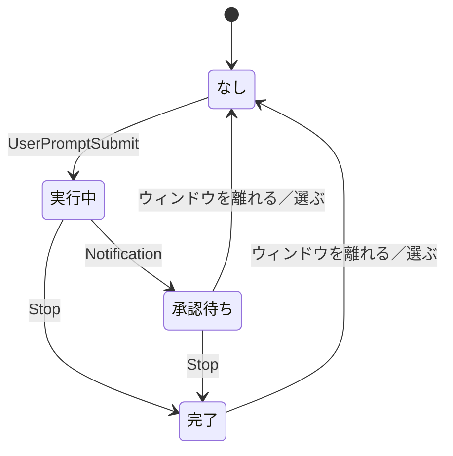

# Claude Code の状態表示

tmux で複数ウィンドウを使っていると、非アクティブなウィンドウで Claude Code が
タスクを終えたり承認待ちになったりしても気づけない。
`bin/tmux-claude-status.sh` は、その状態をウィンドウ名の後ろの印と
ステータスの配色で示す。

## 表示

| 状態 | 配色 | 印 |
| --- | --- | --- |
| 実行中 | 変えない | スピナー（回転する） |
| 承認・入力待ち | 黄 | `!` |
| 完了 | 緑 | `✓` |

印はウィンドウ名の後ろに出る。色を覚えていなくても形で区別できる。

実行中を着色しないのは、スピナーがステータスバー上で唯一動く要素で、
色を足さなくても見つかるため。塗りつぶすとアクティブなウィンドウより
目立ってしまう。色は操作を促したい承認待ち・完了のためだけに使う。

今見ているウィンドウは着色されない。tmux の `window-status-style` が
非アクティブなウィンドウにしか効かないため。
スピナーだけは例外で、アクティブなときも表示される
（`window-status-current-format` にも同じ細工をしているため）。
ウィンドウを行き来しても表示が途切れず、コピーモード中など
Claude Code の画面が見えていないときも状態が分かる。

## 状態の移り変わり

状態は Claude Code のフックで進み、ウィンドウを見ると解除される。



- ウィンドウを離れる／選ぶと「承認待ち」「完了」は既読として解除される。
  「実行中」は既読にならないので、スピナーは回り続ける
- `SessionEnd`（Claude Code の終了）はどの状態からでも「なし」に戻す。
  強制終了などでフックが動かなかった場合も、記録したプロセスが消えていれば
  次にスクリプトが動いた時点で解除される

## 設定

`.tmux.conf` 側は設定済みなので、`~/.claude/settings.json` にフックを追加する。

```bash
make claude-hooks
```

既存の設定は保持され、同じフックが既にあれば何もしない（何度実行してもよい）。
変更前の内容は `settings.json.bak` に残る。`-n` を付けると追加内容だけを表示する。

`~/.claude/settings.json` は環境ごとに内容が異なるため dotfiles の管理対象外。
設定されているかどうかは `make doctor` で確認できる。

手で書く場合は次の内容を追記する。

```json
{
  "hooks": {
    "UserPromptSubmit": [
      { "hooks": [ { "type": "command", "command": "\"$HOME/dotfiles/bin/tmux-claude-status.sh\" running", "timeout": 5 } ] }
    ],
    "Notification": [
      { "hooks": [ { "type": "command", "command": "\"$HOME/dotfiles/bin/tmux-claude-status.sh\" waiting", "timeout": 5 } ] }
    ],
    "Stop": [
      { "hooks": [ { "type": "command", "command": "\"$HOME/dotfiles/bin/tmux-claude-status.sh\" done", "timeout": 5 } ] }
    ],
    "SessionEnd": [
      { "hooks": [ { "type": "command", "command": "\"$HOME/dotfiles/bin/tmux-claude-status.sh\" none", "timeout": 5 } ] }
    ]
  }
}
```

## 仕組み

### 影響する範囲

操作するのは対象ウィンドウのオプションだけで、tmux のグローバル設定は
変更しない（`status-interval` を除く。後述）。
Claude Code を起動していないウィンドウには影響しない。

状態はペインごとに記録し、ウィンドウにはその中で最も強い状態を出す。
強さは承認待ち → 完了 → 実行中の順。

### monitor-activity を一時的に切る

`monitor-activity` が有効だと、出力のあったウィンドウは `#` フラグが付き
`window-status-activity-style`（既定は `reverse`）で反転描画され、
背景色が打ち消される。
Claude Code のウィンドウは常に出力があり `#` は情報量を持たないため、
状態が付いている間は**そのウィンドウの `monitor-activity` のみ**を `off` に
する。ウィンドウオプションなので他のウィンドウの挙動は変わらない
（解除時にグローバル設定へ戻す）。

実行中は着色しないので、配色の有無ではなく状態で判断している。

監視を `off` にしても、**それ以前に立っていた `#` は消えない**。
tmux はウィンドウを実際に表示したときにしかフラグを落とさないため。
プロンプトを打つ時点でそのウィンドウに居るので通常は発生しないが、
残った場合は一度そのウィンドウを開けば消える。

### 直前選択（`-`）フラグの除去

`-`（直前に選択していたウィンドウ）は `monitor-activity` とは無関係なため、
別途 `.tmux.conf` の `window-status-format` で非表示にしている
（`#{s/-//:window_flags}`）。これは全ウィンドウに効く。

### status-interval を実行中だけ上げる

スピナーを動かすには毎秒の再描画が要る。`status-interval` はグローバル設定
のため、**実行中のウィンドウがある間だけ** 1 に上げ、無くなったら元の値へ
戻す。元の値は変更前に保存するので `.tmux.conf` を書き換える必要はない。

承認待ちと完了は静止アイコンなので `#()` を呼ばず、`status-interval` も
上がらない。再描画の頻度が上がるのは実行中のときだけ。

## カスタマイズ

`bin/tmux-claude-status.sh` の冒頭で変えられる。

| 変数 | 内容 |
| --- | --- |
| `STYLE_RUNNING` / `STYLE_WAITING` / `STYLE_DONE` | 状態ごとの配色。`STYLE_RUNNING` は既定で空（着色しない）で、値を入れれば実行中も着色される |
| `SPINNER` | スピナーの有無。`off` にすると `status-interval` も変更されなくなる |
| `ICON_WAITING` / `ICON_DONE` | 承認待ち・完了のアイコン。空文字で非表示 |

### アイコンに使えない文字

アイコンは tmux の書式として解釈されるため `#` を含む文字は使えない。
また絵文字表示を持つ文字（`⚠` `⏸` など）は Unicode の幅属性が半角でも
端末によっては全角描画され、桁がずれることがある。

### スピナーのコマ

`--spinner` の分岐にある `set --` の並びで定義している。
既定は点字セル(2x4)の外周8方向を3点の弧で回すパターン。
毎秒1コマしか進まないため、点灯数が均一で1コマ＝1ステップの回転になる
並びを選んでいる（定番の `⠋⠙⠹⠸⠼⠴⠦⠧` は点灯数が不規則で方向が読めない）。
