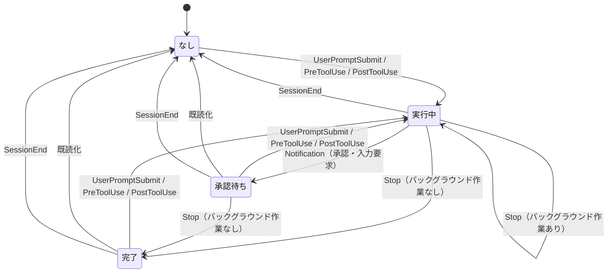

# Claude Code の状態表示

tmux で複数ウィンドウを使っていると、非アクティブなウィンドウで Claude Code がタスクを終えたり承認待ちになったりしても気づけない。
`bin/tmux-claude-status.sh` は、その状態をウィンドウ名の後ろの印とステータスの配色で示す。

```bash
make claude-hooks
```

## 表示

| 状態 | 配色 | 印 |
| --- | --- | --- |
| 実行中 | 変えない（グローバル設定のまま） | スピナー（回転する） |
| 承認待ち | 黄 | `!` |
| 完了 | 緑 | `✓` |

印はウィンドウ名とフラグの後ろに出る。色を覚えていなくても形で区別できる。

今見ているウィンドウは着色されない（tmux の `window-status-style` が非アクティブなウィンドウにしか効かないため）。
スピナーだけは例外で、アクティブなときも表示される。
ウィンドウを行き来しても表示が途切れず、コピーモード中など Claude Code の画面が見えていないときも状態が分かる。

## 導入

### 前提

| 要件 | 確認方法 | 備考 |
| --- | --- | --- |
| `.tmux.conf` が配置されている | `make minimal` 以上のプリセット | 既読化のフックと `focus-events on` がここにある |
| `jq` が入っている | `jq --version` | `make claude-hooks` が使う。状態表示でも使うが、無い場合は文字列の一致で代用する |

`agent` プリセット（Claude Code 設定のみ）では `.tmux.conf` が配置されない。
その場合は既読化が働かず「承認待ち」「完了」が消えないので、[既読化のフック](#既読化のフック)を自分の `.tmux.conf` に写す。

### フックを追加する

`~/.claude/settings.json` にフックを追加する。

```bash
make claude-hooks
```

既存の設定は保持され、同じフックが既にあれば何もしない（何度実行してもよい）。
変更前の内容は `settings.json.bak` に残る。

追加される内容を実行前に見る場合はスクリプトを直接呼ぶ。

```bash
./bin/install-claude-hooks.sh -n
```

`~/.claude/settings.json` は環境ごとに内容が異なるため dotfiles の管理対象外。
設定されているかどうかは `make doctor` で確認できる。

### 追加される内容

手で書く場合は次の内容を追記する。`$HOME/dotfiles` の部分はこのリポジトリを置いた場所に読み替える（`make claude-hooks`は実際の配置から組み立てる）。

```json
{
  "hooks": {
    "UserPromptSubmit": [
      { "hooks": [ { "type": "command", "command": "\"$HOME/dotfiles/bin/tmux-claude-status.sh\" running", "timeout": 5 } ] }
    ],
    "PreToolUse": [
      { "hooks": [ { "type": "command", "command": "\"$HOME/dotfiles/bin/tmux-claude-status.sh\" running", "timeout": 5 } ] }
    ],
    "PostToolUse": [
      { "hooks": [ { "type": "command", "command": "\"$HOME/dotfiles/bin/tmux-claude-status.sh\" running", "timeout": 5 } ] }
    ],
    "Notification": [
      { "matcher": "permission_prompt|elicitation_dialog|elicitation_url_dialog|agent_needs_input", "hooks": [ { "type": "command", "command": "\"$HOME/dotfiles/bin/tmux-claude-status.sh\" waiting", "timeout": 5 } ] }
    ],
    "Stop": [
      { "hooks": [ { "type": "command", "command": "\"$HOME/dotfiles/bin/tmux-claude-status.sh\" done", "timeout": 5 } ] }
    ],
    "SessionEnd": [
      { "hooks": [ { "type": "command", "command": "\"$HOME/dotfiles/bin/tmux-claude-status.sh\" none", "timeout": 5 } ] }
    ]
  }
}
```

`Notification` の `matcher` は必須。
省略すると入力を促すもの以外の通知（放置すると届く `idle_prompt` など）まで拾ってしまい、「完了」の表示がすぐ「承認待ち」に化ける。

`PreToolUse` と `PostToolUse` には `matcher` を付けない。
ツールを1つでも呼んでいれば本体が動いている証拠なので、種類で区別する理由がない。

### 既読化のフック

`.tmux.conf` 側（設定済み）。ウィンドウを見た時点で状態を解除する。

```tmux
set -g focus-events on
set-hook -g pane-focus-out      'run-shell -b "$HOME/dotfiles/bin/tmux-claude-status.sh --ack #{window_id}"'
set-hook -g after-select-window 'run-shell -b "$HOME/dotfiles/bin/tmux-claude-status.sh --ack #{window_id}"'
```

### やめる

`~/.claude/settings.json` から `tmux-claude-status` を含むフックを消す。
残った表示はウィンドウごとに解除できる。

```bash
tmux set-window-option -u -t <window> window-status-style
tmux set-window-option -u -t <window> window-status-format
tmux set-window-option -u -t <window> window-status-current-format
tmux set-window-option -u -t <window> monitor-activity
```

## 挙動

状態は Claude Code のフックで進み、ウィンドウを見ると解除される。



- 「実行中」に戻す入口は3つ。ユーザが入力した時（`UserPromptSubmit`）と、ツールを呼ぶ時（`PreToolUse`）と、ツールが終わった時（`PostToolUse`）
- バックグラウンド作業が残っている間の `Stop` は「完了」にしない。判断には `Stop` の入力に含まれる `background_tasks` を使う（[後述](#バックグラウンド作業が残っている間は完了にしない)）
- 「承認待ち」にするのは承認ダイアログや入力要求の通知だけ。通知の種類は `matcher` で絞る（[追加される内容](#追加される内容)）
- 既読化はウィンドウを選んだ時（`after-select-window`）とペインからフォーカスが外れた時（`pane-focus-out`）に走る。対象は「承認待ち」「完了」だけで、「実行中」は残るのでスピナーは回り続ける
- `SessionEnd`（Claude Code の終了）はどの状態からでも「なし」に戻す。強制終了などでフックが動かなかった場合も、記録したプロセスが消えていれば次にスクリプトが動いた時点で解除される

### ペインとウィンドウ

状態はペインごとに記録し、ウィンドウにはその中で最も強い状態を出す。
強さは承認待ち → 完了 → 実行中の順。

記録先は tmpfs 上の状態ファイルで、再起動で消える。

| 項目 | 値 |
| --- | --- |
| 置き場所 | `$XDG_RUNTIME_DIR/tmux-claude-status/`（無ければ `/tmp/tmux-claude-status-$(id -u)`） |
| ファイル名 | `<tmux サーバの PID>-<ペイン番号>` |
| 内容 | `状態<TAB>Claude Code の PID<TAB>ウィンドウ ID` |

ファイル名に tmux サーバの PID を含めるため、`tmux -L` で複数のサーバを併用しても衝突しない。

### 影響する範囲

操作するのは対象ウィンドウのオプションだけで、Claude Code を起動していないウィンドウには影響しない。
グローバルに触るのは `status-interval` と、その退避先の`@claude-saved-status-interval` の2つだけ（[後述](#status-interval-を実行中だけ上げる)）。

tmux の外、または tmux が無い環境では何もせず正常終了する。

## カスタマイズ

`bin/tmux-claude-status.sh` の冒頭で変えられる。

| 変数 | 内容 |
| --- | --- |
| `STYLE_RUNNING` / `STYLE_WAITING` / `STYLE_DONE` | 状態ごとの配色。`STYLE_RUNNING` は既定で空（着色しない）で、値を入れれば実行中も着色される |
| `SPINNER` | スピナーの有無。`off` にすると `status-interval` も変更されなくなる |
| `ICON_WAITING` / `ICON_DONE` | 承認待ち・完了のアイコン。空文字で非表示 |

アイコンは tmux の書式として解釈されるため `#` を含む文字は使えない。
また絵文字表示を持つ文字（`⚠` `⏸` など）は Unicode の幅属性が半角でも端末によっては全角描画され、桁がずれることがある。

スピナーのコマは `--spinner` の分岐にある `set --` の並びで定義している。
既定は点字セル(2x4)の外周8方向を3点の弧で回すパターン。
毎秒1コマしか進まないため、点灯数が均一で1コマ＝1ステップの回転になる並びを選んでいる（定番の `⠋⠙⠹⠸⠼⠴⠦⠧` は点灯数が不規則で方向が読めない）。

## 困ったとき

| 症状 | 対処 |
| --- | --- |
| 何も表示されない | `make doctor` でフック設定を確認する。`jq` が無いと `make claude-hooks` が失敗している |
| 承認待ち・完了が消えない | `.tmux.conf` の既読化フックと `focus-events on` が入っているか確認する（[既読化のフック](#既読化のフック)） |
| ウィンドウに `#` が残る | 一度そのウィンドウを開く。tmux は実際に表示したときにしかフラグを落とさない |
| 実行中の印が消えない | バックグラウンド作業が残っていないか確認する。`Stop` は `background_tasks` に動いているものが無くなるまで「完了」にしない |
| 状態が残ったまま戻らない | 状態ファイルを消す（`rm -rf "$XDG_RUNTIME_DIR/tmux-claude-status"`）か、tmux サーバを終了する |
| ステータスバーの更新が速いままになった | `tmux show -gv status-interval` を確認する。1 のままなら `tmux set -g status-interval 10` で戻す |

## 仕組み

以下は設計上の判断の記録。実装の詳細は`bin/tmux-claude-status.sh` のコメントを参照。

### ツール呼び出しでも「実行中」に戻す

バックグラウンド作業の完了で本体が再開するとき、ユーザは何も入力していないので `UserPromptSubmit` は発火しない。
状態を「実行中」に戻せるのはツール関連のイベントだけなので、`PreToolUse` と `PostToolUse` の両方を使う。

`PreToolUse` は時間のかかるツールでも、その開始時点で「実行中」にできる。
`PostToolUse` は承認ダイアログを承認した直後に効く。
承認そのものを知らせるイベントが無いため、これが無いと承認して作業が再開しても「承認待ち」の印が残ったままになる。

ツールを呼ぶたびにフックが走るので、既に「実行中」が記録されている場合は状態ファイルを読んだだけで終了する。
tmux を起動するのは状態が実際に動くときだけで、通常のターンの途中では1回も起動しない。

### バックグラウンド作業が残っている間は完了にしない

`Stop` はメインエージェントが応答を終えた時点で発火する。
このときバックグラウンドのシェルやサブエージェントが動いていることがあり、そのまま「完了」にすると誤報になる。

`Stop` の入力には、このセッションのバックグラウンド作業を並べた `background_tasks` が含まれる。
その中に動いているもの（`status` が `running` か `pending`）があれば、「完了」にせず「実行中」を維持する。
作業が終わると Claude Code がエージェントを呼び直し、空の `background_tasks` を持つ `Stop` が改めて届くので、そこで「完了」になる。

判定は `jq` があれば `jq` で行い、無ければ文字列の一致で代用する。
このスクリプトの実行時に `jq` を必須にしないため。
`background_tasks` を返さない古い Claude Code では判定が常に偽になり、従来どおり `Stop` がそのまま「完了」になる。

### 実行中を着色しない

スピナーはステータスバー上で唯一動く要素で、色を足さなくても見つかる。
塗りつぶすとアクティブなウィンドウより目立ってしまう。
色は操作を促したい承認待ち・完了のためだけに使う。

### monitor-activity を一時的に切る

`monitor-activity` が有効だと、出力のあったウィンドウは `#` フラグが付き `window-status-activity-style`（既定は `reverse`）で反転描画され、背景色が打ち消される。
Claude Code のウィンドウは常に出力があり `#` は情報量を持たないため、状態が付いている間は**そのウィンドウの `monitor-activity` のみ**を `off` にする。ウィンドウオプションなので他のウィンドウの挙動は変わらない（解除時にグローバル設定へ戻す）。

実行中は着色しないので、切り替えの判断は配色の有無ではなく状態で行っている。

### 直前選択（`-`）フラグの除去

`-`（直前に選択していたウィンドウ）は `monitor-activity` とは無関係なため、別途 `.tmux.conf` の `window-status-format` で非表示にしている（`#{s/-//:window_flags}`）。これは全ウィンドウに効く。

### status-interval を実行中だけ上げる

スピナーを動かすには毎秒の再描画が要る。`status-interval` はグローバル設定のため、**実行中のウィンドウがある間だけ** 1 に上げ、無くなったら元の値へ戻す。元の値は `@claude-saved-status-interval` に退避するので `.tmux.conf` を書き換える必要はない。

承認待ちと完了は静止アイコンなので `#()` を呼ばず、`status-interval` も上がらない。再描画の頻度が上がるのは実行中のときだけ。
