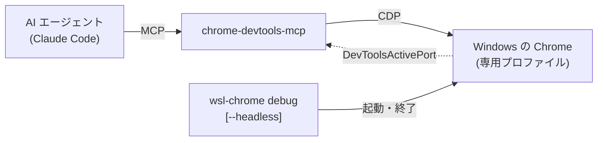

# wsl-chrome

WSL2 から Windows 側の Google Chrome を操作するコマンド。
URL を開くだけの用途に加えて、CDP（Chrome DevTools Protocol）を有効にした専用インスタンスを起動でき、そこへ [chrome-devtools-mcp](https://github.com/ChromeDevTools/chrome-devtools-mcp) を繋ぐと AI エージェントがページの表示・DOM・コンソール・通信を確認できる。

Windows 側の Chrome をそのまま使うため、実際のフォント・スケーリング・拡張機能を含んだ見た目を確認できる。

## 使い方

```bash
wsl-chrome https://example.com    # URL を開く
wsl-chrome ./index.html           # ファイルを Windows パスに変換して開く
wsl-chrome debug [url]            # CDP 有効の専用インスタンスを起動する
wsl-chrome debug --headless [url] # 画面に出さずに起動する
wsl-chrome status                 # 接続先・モード・開いているタブを表示する
wsl-chrome stop                   # 専用インスタンスを終了する
```

`debug` は起動済みなら再利用し、URL を渡せば同じインスタンスのタブとして開く。

| 環境変数 | 既定 | 内容 |
| --- | --- | --- |
| `WSL_CHROME_PORT` | （自動） | CDP のポートを固定する。通常は指定しない |
| `WSL_CHROME_PROFILE` | `debug` | `debug` は専用プロファイル、`default` は普段使いのプロファイル |
| `WSL_CHROME_HEADLESS` | `0` | `1` なら `--headless` を付けたのと同じ |
| `WSL_CHROME_WINDOW_SIZE` | `1280,800` | ヘッドレス時のビューポート |

## 構成



`wsl-chrome` は Chrome の起動と停止だけを担い、ページ操作は MCP 側が受け持つ。

## ヘッドレス

`--headless` を付けると画面にウィンドウを出さずに起動する。
描画エンジンもフォントも通常モードと同じで、スクリーンショットの見た目は変わらない。
ウィンドウが無いぶんビューポートが `WSL_CHROME_WINDOW_SIZE` で決まるため、画面の大きさに左右されずスクリーンショットの寸法を再現できる。

| | 通常 | ヘッドレス |
| --- | --- | --- |
| 人が同じ画面を見る | できる | できない |
| スクリーンショットの寸法 | ウィンドウ依存 | `WSL_CHROME_WINDOW_SIZE` で固定 |
| ログイン・手動操作 | 人が介入できる | CDP 経由のみ |
| 描画結果 | 同一 | 同一 |

エージェントに任せきるならヘッドレス、隣で一緒に見ながら詰めるなら通常モードを使う。

両モードはポートとプロファイルを共有するため、同時には起動できない。
MCP の登録を1つで済ませるためにこうしている。
起動中と違うモードを指定すると、動いている方のモードを示して終了するので、`stop` してから起動し直す。
`status` は指定ではなく実際に動いているインスタンスのモードを表示する（CDP が返す User-Agent で判別している）。

## 専用プロファイル

`debug` は `%LOCALAPPDATA%\wsl-chrome-debug` を `--user-data-dir` に指定して、普段使いの Chrome とは別のインスタンスを立てる。
Chrome は同じプロファイルのインスタンスが既に動いていると `--remote-debugging-port` を無視するため、専用プロファイルにしないと普段使いの Chrome を全て閉じてからでないと起動できない。
プロファイルを分けることで、エージェントの操作が普段のタブに混ざることも防げる。

ログイン後の画面を確認したい場合は、この専用プロファイルで一度ログインしておく。
どうしても普段使いのプロファイルが要る場合は `WSL_CHROME_PROFILE=default` を指定するが、事前に Chrome を全て終了させる必要がある。
この場合 `stop` は通常の Chrome ごと閉じてしまうため、実行を拒否する。

プロファイルは Windows 側のパスに置く。
Chrome は `\\wsl.localhost\...` のような WSL 側のパスを UNC と見なして `--user-data-dir` に受け付けない。

## MCP の登録

Claude Code に登録して、起動済みの Chrome へ接続させる。

```bash
claude mcp add -s user chrome-devtools -- npx -y chrome-devtools-mcp@latest \
  --autoConnect --userDataDir "$(wslpath -u "$(cmd.exe /c 'echo %LOCALAPPDATA%' 2>/dev/null | tr -d '\r\n')")/wsl-chrome-debug"
```

登録先の `~/.claude.json` はこのリポジトリの管理対象外なので、環境ごとに一度実行する。

`--autoConnect` を渡すと MCP は自分でブラウザを起動せず、`--userDataDir` で指定したプロファイルで動いているインスタンスを探して接続する。
そのため使う前に `wsl-chrome debug` を実行しておく。

接続はツールを呼ぶたびに行われる。
MCP を常駐させたまま Chrome を停止・再起動してよく、ポートが変わっても追随する（ページ番号が変わった旨が応答に付く）。
`--autoConnect` には Chrome 144 以上が要る。

## ポートについて

ポートは固定しない。
`--remote-debugging-port=0` で起動して Chrome に空きポートを選ばせ、Chrome がプロファイル直下の `DevToolsActivePort` に書き出した番号を読む。
MCP 側も `--autoConnect --userDataDir` で同じファイルを読むため、両者はポート番号ではなくプロファイルディレクトリで結び付く。

固定しない理由は、CDP の慣例である 9222 が他のプロセスに使われていることがあるため。
Chrome は指定ポートの IPv4 バインドに失敗しても起動は成功し、IPv6 のみで待ち受ける。
WSL のミラーモードでは Windows の `::1` に届かないため、正常に起動したように見えて接続できない状態になる。
空きポートを選ばせればこの事故は起こらない。

`WSL_CHROME_PORT` を指定すると従来どおり固定できる。
その場合は起動前に `NETSTAT` でポートの空きを確認し、埋まっていれば占有プロセスを表示して中止する。
`--autoConnect` が使えない場合（Chrome 144 未満）の逃げ道として残してある。
このときは MCP 側も `--browserUrl http://127.0.0.1:<ポート>` に変える。

`DevToolsActivePort` は Chrome の終了後も残るため、`status` はファイルの値を信用せず CDP に問い合わせて生死を判定する。
`stop` はこのファイルも消す。

## 制約

- WSL2 でのみ動作する。ネイティブの Linux で実行すると理由を表示して終了する
- `status` のタブ一覧の整形に `jq` を使う。無い場合は一覧を省略する
- 起動済みインスタンスへのタブ追加は CDP の `PUT /json/new` で行う。ヘッドレスにはウィンドウが無く、`chrome.exe` を再度起動しても既存インスタンスに引き継がれないため
